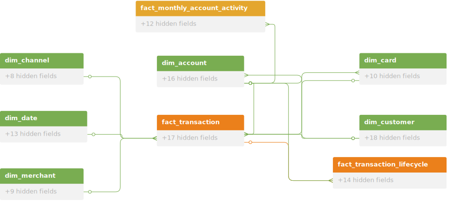

<h1 align="center" style="color:blue;"> Consumer Banking Data Model </h1>

<p align="center">
  
</p>

## 1. Use case and Functional Requirements

**Use case:** support retail banking operations and analytics — account onboarding, KYC, transaction ledger, posting & settlement, disputes, monthly statements, fraud detection, and regulatory reporting.

Functional requirements (FR):

- FR1: Onboard accounts and customers with full auditability and point-in-time queries → dimension history required (SCD-II).
- FR2: Capture every financial event (debit/credit) for ledger accuracy, fraud, and reconciliation → append-only transactional fact.
- FR3: Track posting, settlement, dispute lifecycle milestones and SLA → single-row accumulating fact per process.
- FR4: Produce monthly statements and KPI snapshots tolerating late-posts → monthly snapshot with recompute window.
- FR5: Fast operational lookups for current attributes (KYC, account status) → current flag/index on SCD-II dimensions.
- FR6: Auditability and traceability for compliance → include ETL audit columns and natural keys for reconciliation.

## 2. Schema details

### 2.1 Conceptual

We will be using star schema model to build functional requirements. Use SCD-II for `dim_customer` and `dim_account` where history and point-in-time queries are required. Use SCD-I for non-historical dimensions. Facts include an append-only transactional ledger, an accumulating fact for lifecycle processes, and periodic snapshots for reporting.

Primary tables (purpose & grain):

- `dim_customer` (SCD-II) — grain: customer × version. Stores historical customer attributes for point-in-time joins and audits.
- `dim_account` (SCD-II) — grain: account × version. Stores account attributes and product migrations over time.
- `dim_merchant` (SCD-I) — grain: merchant (latest). Merchant descriptive attributes.
- `dim_channel` (SCD-I) — grain: channel (latest). Channel metadata (ATM, POS, ONLINE).
- `dim_card` (SCD-I) — grain: card (latest). Card metadata (brand, BIN).
- `fact_transaction` (transactional fact) — grain: one row per transaction event. Detailed ledger for fraud and reconciliation.
- `fact_transaction_lifecycle` (accumulating fact) — grain: one row per process/transaction instance. Tracks lifecycle milestones (initiated → authorized → posted → settled → dispute → resolved).
- `fact_monthly_account_activity` (monthly snapshot) — grain: account × calendar_month. Monthly KPIs for statements and dashboards.
- optional: `dim_date` — calendar/date dimension to aid reporting and partitioning.

All dimensions use surrogate keys (`*_sk`) and retain source natural keys (`*_id`) for reconciliation.

**Schema Structure:**

Based on the consumer banking data model, here's the conceptual schema structure:

<figure>
  
</figure>

### 2.2 Table Details

Below are the list of tables with column details:

#### 2.2.1 `dim_customer` (SCD-II)

**Description:** Stores customer identity and descriptive attributes. Each row represents the state of a customer for a validity period (SCD-II). Supports point-in-time reporting, KYC history, and audit requirements.

| Column Name        | Data Type   | Description                                                                |
| ------------------ | ----------- | -------------------------------------------------------------------------- |
| `customer_sk`    | bigint (PK) | Surrogate key for the customer version row.                                |
| `customer_id`    | varchar     | Natural key from source system (customer identifier).                      |
| `name`           | varchar     | Customer full name.                                                        |
| `dob`            | date        | Date of birth.                                                             |
| `primary_phone`  | varchar     | Primary contact number.                                                    |
| `email`          | varchar     | Email address.                                                             |
| `address`        | varchar     | Standardized mailing address (single field or JSON depending on platform). |
| `kyc_status`     | varchar     | KYC/compliance status (e.g., VERIFIED, PENDING).                           |
| `risk_segment`   | varchar     | Risk or segment classification.                                            |
| `effective_from` | timestamp   | Inclusive start of validity for this row.                                  |
| `effective_to`   | timestamp   | Exclusive end of validity (NULL when current).                             |
| `is_current`     | boolean     | True when row is the current version for the natural key.                  |
| `version_number` | integer     | Monotonic version counter for the natural key.                             |
| `etl_loaded_ts`  | timestamp   | When this version row was loaded into the warehouse.                       |
| `etl_batch_id`   | varchar     | ETL batch identifier for traceability.                                     |
| `source_system`  | varchar     | Source system identifier.                                                  |

Notes:

- Insert a new row for any attribute change; close the previous row by setting `effective_to` and `is_current = false`.
- Index `is_current` + `customer_id` for fast operational lookups; create a composite index on `customer_id, effective_from` for point-in-time joins.

#### 2.2.2 `dim_account` (SCD-II)

Description: Stores account-level attributes and product/status history. Each row represents the state of an account for a validity period.

| Column Name        | Data Type   | Description                                                      |
| ------------------ | ----------- | ---------------------------------------------------------------- |
| `account_sk`     | bigint (PK) | Surrogate key for the account version row.                       |
| `account_id`     | varchar     | Natural account identifier from source.                          |
| `customer_sk`    | bigint (FK) | FK to `dim_customer.customer_sk` (version-specific as needed). |
| `account_type`   | varchar     | e.g., CHECKING, SAVINGS, CREDIT_CARD.                            |
| `currency`       | varchar     | Account currency (ISO code).                                     |
| `status`         | varchar     | e.g., ACTIVE, CLOSED, DORMANT.                                   |
| `opened_date`    | date        | Account opening date.                                            |
| `closed_date`    | date        | Account closure date (if any).                                   |
| `product_code`   | varchar     | Product or pricing plan code.                                    |
| `effective_from` | timestamp   | Inclusive start of validity for this row.                        |
| `effective_to`   | timestamp   | Exclusive end of validity (NULL when current).                   |
| `is_current`     | boolean     | True when row is the current version.                            |
| `version_number` | integer     | Monotonic version counter for the account.                       |
| `etl_loaded_ts`  | timestamp   | Load timestamp into the warehouse.                               |
| `etl_batch_id`   | varchar     | ETL batch id for traceability.                                   |
| `source_system`  | varchar     | Source system identifier.                                        |

Notes:

- Use SCD-II flow: close prior version and insert new version on attribute changes (product migrations, status changes).
- Index on `account_id, is_current` for fast lookups; support point-in-time joins via `effective_from`/`effective_to`.

#### 2.2.3 `dim_merchant` (SCD-I)

Description: Merchant descriptive attributes used to enrich transactions. Overwrite on change unless historical merchant profiling is required.

| Column Name         | Data Type   | Description                                |
| ------------------- | ----------- | ------------------------------------------ |
| `merchant_sk`     | bigint (PK) | Surrogate key.                             |
| `merchant_id`     | varchar     | Natural merchant identifier.               |
| `merchant_name`   | varchar     | Merchant display name.                     |
| `mcc`             | varchar     | Merchant Category Code.                    |
| `category`        | varchar     | High-level category (e.g., GROCERY, FUEL). |
| `address`         | varchar     | Merchant address.                          |
| `contact`         | varchar     | Merchant contact info.                     |
| `last_updated_ts` | timestamp   | Last update timestamp.                     |
| `source_system`   | varchar     | Source system identifier.                  |

Notes:

- Overwrite rows on update. Maintain `last_updated_ts` for audit and source reconciliation.
- Index `merchant_id` and `mcc` for common queries.

#### 2.2.4 `dim_channel` (SCD-I)

Description: Channel metadata for transactions (ATM, POS, ONLINE). Small, operational dimension.

| Column Name         | Data Type   | Description                           |
| ------------------- | ----------- | ------------------------------------- |
| `channel_sk`      | bigint (PK) | Surrogate key.                        |
| `channel_id`      | varchar     | Natural channel identifier.           |
| `channel_name`    | varchar     | e.g., ATM, POS, ONLINE.               |
| `channel_type`    | varchar     | Further classification when required. |
| `description`     | varchar     | Free text description.                |
| `last_updated_ts` | timestamp   | Last update timestamp.                |
| `source_system`   | varchar     | Source system identifier.             |

Notes:

- Overwrite on change; small dimension so SCD-I works well.

#### 2.2.5 `dim_card` (SCD-I)

Description: Card metadata for transactions (brand, BIN range, issuer).

| Column Name         | Data Type   | Description                                             |
| ------------------- | ----------- | ------------------------------------------------------- |
| `card_sk`         | bigint (PK) | Surrogate key.                                          |
| `card_id`         | varchar     | Natural card identifier (masked token or BIN-based id). |
| `card_brand`      | varchar     | Visa, MasterCard, AMEX, etc.                            |
| `bin_prefix`      | varchar     | BIN or BIN range prefix.                                |
| `card_type`       | varchar     | e.g., DEBIT, CREDIT, PREPAID.                           |
| `issuer`          | varchar     | Issuing bank name or code.                              |
| `last_updated_ts` | timestamp   | Last update timestamp.                                  |
| `source_system`   | varchar     | Source system identifier.                               |

Notes:

- Overwrite on change; include `last_updated_ts` and `source_system`.

#### 2.2.6 `fact_transaction` (transactional fact)

Description: The transaction ledger — one row per transaction event (authorization/posting/reversal). This is the primary source for fraud, reconciliation, and transaction analytics.

| Column Name                | Data Type     | Description                                                                            |
| -------------------------- | ------------- | -------------------------------------------------------------------------------------- |
| `transaction_sk`         | bigint (PK)   | Surrogate key for the fact row.                                                        |
| `transaction_id`         | varchar       | Natural transaction identifier from source.                                            |
| `account_sk`             | bigint (FK)   | FK to `dim_account.account_sk` (current or versioned lookup via point-in-time join). |
| `customer_sk`            | bigint (FK)   | FK to `dim_customer.customer_sk` (version-specific for point-in-time).               |
| `merchant_sk`            | bigint (FK)   | FK to `dim_merchant.merchant_sk`.                                                    |
| `channel_sk`             | bigint (FK)   | FK to `dim_channel.channel_sk`.                                                      |
| `card_sk`                | bigint (FK)   | FK to `dim_card.card_sk`.                                                            |
| `transaction_ts`         | timestamp     | Event timestamp (authorization/transaction time).                                      |
| `posting_ts`             | timestamp     | Posting/settlement timestamp.                                                          |
| `amount`                 | decimal(18,2) | Signed amount (debit negative / credit positive).                                      |
| `currency`               | varchar(3)    | ISO currency code.                                                                     |
| `transaction_type`       | varchar       | e.g., POS, ATM, ACH, TRANSFER, FEE.                                                    |
| `status`                 | varchar       | e.g., AUTHORIZED, POSTED, REVERSED.                                                    |
| `auth_code`              | varchar       | Authorization code if available.                                                       |
| `fee_amount`             | decimal(18,2) | Fee portion (if applicable).                                                           |
| `reversal_flag`          | boolean       | True if this row represents a reversal/adjustment.                                     |
| `related_transaction_id` | varchar       | Link to original txn for reversals/adjustments.                                        |
| `etl_loaded_ts`          | timestamp     | ETL load timestamp.                                                                    |
| `etl_batch_id`           | varchar       | ETL batch identifier.                                                                  |
| `source_system`          | varchar       | Source system identifier.                                                              |

Notes:

- Append-only inserts. Use `transaction_id|source_system` as dedupe key during ingest.
- Partition by `transaction_ts` and include indexes on `account_sk`, `customer_sk`, and `transaction_ts` for common queries.

#### 2.2.7 `fact_transaction_lifecycle` (accumulating fact)

Description: One row per transaction/process instance that tracks lifecycle milestones useful for SLA and workflow reporting.

| Column Name                  | Data Type     | Description                                          |
| ---------------------------- | ------------- | ---------------------------------------------------- |
| `transaction_lifecycle_sk` | bigint (PK)   | Surrogate key.                                       |
| `transaction_id`           | varchar       | Natural txn id (links back to `fact_transaction`). |
| `account_sk`               | bigint (FK)   | FK to `dim_account`.                               |
| `customer_sk`              | bigint (FK)   | FK to `dim_customer`.                              |
| `initiated_ts`             | timestamp     | When process initiated.                              |
| `authorized_ts`            | timestamp     | Authorization timestamp.                             |
| `posted_ts`                | timestamp     | Posting timestamp.                                   |
| `settled_ts`               | timestamp     | Settlement timestamp.                                |
| `dispute_opened_ts`        | timestamp     | When dispute opened (if any).                        |
| `dispute_resolved_ts`      | timestamp     | When dispute resolved (if any).                      |
| `current_status`           | varchar       | Current lifecycle status.                            |
| `owner_queue`              | varchar       | Current processing owner/queue.                      |
| `total_amount`             | decimal(18,2) | Total amount involved.                               |
| `currency`                 | varchar(3)    | Currency code.                                       |
| `last_updated_ts`          | timestamp     | Last update to this lifecycle row.                   |
| `etl_batch_id`             | varchar       | ETL batch id for updates.                            |
| `source_system`            | varchar       | Source system identifier.                            |

Notes:

- Upsert pattern: insert on process start; update milestone columns as events occur. Use conditional updates to avoid overwriting with stale data.
- Include `last_updated_ts` and `etl_batch_id` to support idempotency and reconciliation.

#### 2.2.8 `fact_monthly_account_activity` (monthly snapshot/fact)

Description: Monthly aggregated rows per account for fast reporting and statement generation. Treated as a monthly fact (recomputed or incrementally maintained).

| Column Name           | Data Type     | Description                              |
| --------------------- | ------------- | ---------------------------------------- |
| `account_sk`        | bigint        | FK to `dim_account`.                   |
| `year_month`        | varchar(7)    | YYYY-MM representation for partitioning. |
| `opening_balance`   | decimal(18,2) | Balance at start of month.               |
| `closing_balance`   | decimal(18,2) | Balance at end of month.                 |
| `total_credits`     | decimal(18,2) | Sum of credits in month.                 |
| `total_debits`      | decimal(18,2) | Sum of debits in month.                  |
| `avg_daily_balance` | decimal(18,2) | Average daily balance over the month.    |
| `num_txns`          | integer       | Number of transactions in the month.     |
| `num_disputes`      | integer       | Number of disputes opened in the month.  |
| `snapshot_ts`       | timestamp     | When snapshot was generated.             |
| `etl_batch_id`      | varchar       | ETL batch id used to compute this row.   |
| `source_system`     | varchar       | Source system identifier.                |

Notes:

- Partition by `year_month`. Recompute recent months on a schedule to capture late-posting transactions; either full-month recompute or incremental adjustments.

#### 2.2.9 `dim_date` (optional)

Description: Calendar/date dimension to support reporting and easy joins.

| Column Name         | Data Type | Description                                             |
| ------------------- | --------- | ------------------------------------------------------- |
| `date_sk`         | int (PK)  | Surrogate date key (YYYYMMDD integer or sequential id). |
| `date`            | date      | Actual date.                                            |
| `day`             | int       | Day of month.                                           |
| `month`           | int       | Month number.                                           |
| `year`            | int       | Year.                                                   |
| `quarter`         | int       | Quarter of year.                                        |
| `is_business_day` | boolean   | Flag for business day.                                  |

Notes:

- Typical supporting dimension for time-based reporting and partition pruning.

## 3. Schema diagram

<figure align="center">
    
</figure>


## 4. Implementation details — FR → tables

This section maps each functional requirement (FR) to the tables and describes the concrete implementation patterns used to meet the requirement.

### 4.1 FR1 — Onboard accounts and customers (auditability & point-in-time)

- Tables used: `dim_customer` (SCD-II), `dim_account` (SCD-II).
- How it's done:
  - Use SCD-II versioning: insert a new version row on any attribute change and close the previous row with `effective_to` and `is_current = false`.
  - Store `etl_loaded_ts`, `etl_batch_id`, and `source_system` for each version row for full traceability.
  - Maintain `version_number` and indexes on `customer_id, is_current` and `account_id, is_current` for fast operational lookups.
  - Support point-in-time joins by matching a fact's timestamp between `effective_from` and `effective_to` on the appropriate dimension.

### 4.2 FR2 — Capture every financial event (ledger accuracy, fraud, reconciliation)

- Tables used: `fact_transaction` plus enrichment via `dim_account`, `dim_customer`, `dim_merchant`, `dim_channel`, `dim_card`.
- How it's done:
  - Ingest transactions as append-only rows into `fact_transaction`.
  - Use deterministic dedupe key (`transaction_id|source_system`) and `etl_batch_id` to ensure idempotency and avoid duplicates.
  - Keep both `transaction_ts` (event time) and `posting_ts` (posting/settlement time) to support latency-aware analytics and settle-time reporting.
  - Enrich facts by joining to dimensions (use point-in-time join for SCD-II dims when analyzing historical behavior).
  - Partition `fact_transaction` by `transaction_ts` and index on `account_sk`, `customer_sk`, and `transaction_ts` for performance.

### 4.3 FR3 — Track posting, settlement, dispute lifecycle and SLA

- Tables used: `fact_transaction_lifecycle` (accumulating fact), `fact_transaction` for event details.
- How it's done:
  - Use an accumulating fact `fact_transaction_lifecycle` where each process/transaction has a single row with milestone columns (`initiated_ts`, `authorized_ts`, `posted_ts`, `settled_ts`, `dispute_opened_ts`, `dispute_resolved_ts`).
  - Upsert behavior: insert when the process starts, update milestone columns as events arrive; use `last_updated_ts` to prevent stale overwrites and conditional updates only when incoming milestone > existing milestone.
  - Use `fact_transaction` events to populate or validate lifecycle milestones and to provide audit trail/detail for any lifecycle step.
  - Build views or materialized aggregates for SLA reporting (e.g., avg time from `dispute_opened_ts` to `dispute_resolved_ts`).

### 4.4 FR4 — Produce monthly statements and KPI snapshots tolerant of late-posts

- Tables used: `fact_monthly_account_activity` (monthly fact/snapshot), derived from `fact_transaction` and balances.
- How it's done:
  - Compute `fact_monthly_account_activity` per `account_sk` × `year_month` either via full-month recompute or incremental windowed updates.
  - To handle late posting, schedule nightly recompute for recent months (e.g., last 3 months) and full recompute for closed historical months as needed.
  - Store `etl_batch_id` on the monthly rows and keep `snapshot_ts` so consumers know when the row was produced.
  - Partition monthly rows by `year_month` for performance; use incremental adjustments where feasible to avoid full recompute.

### 4.5 FR5 — Fast operational lookups for current attributes (KYC, account status)

- Tables used: `dim_customer` (SCD-II), `dim_account` (SCD-II), optionally materialized views for `is_current` rows.
- How it's done:
  - Keep `is_current` boolean on SCD-II dims and index `(natural_id, is_current)` for O(1) current lookups.
  - Optionally maintain small `dim_customer_current` / `dim_account_current` materialized views (or filtered physical tables) containing only `is_current = true` rows for the fastest operational queries.
  - Enforce constraints in ETL so that at most one `is_current = true` row exists per natural key.

### 4.6 FR6 — Auditability and traceability for compliance

- Tables used: all tables include audit columns; reconciliation layers (views) built from natural keys.
- How it's done:
  - Include `etl_loaded_ts`, `etl_batch_id`, and `source_system` on every table row to trace back to source extracts.
  - Keep original natural keys (`customer_id`, `account_id`, `transaction_id`) alongside surrogate keys for reconciliation.
  - Build reconciliation views and incremental checks (row counts, sums by partition) comparing source extracts to warehouse loads.
  - Retain audit history according to policy (e.g., keep SCD-II history indefinitely, archive old fact partitions to cheaper storage but keep monthly facts for reporting).

### 4.7 Cross-cutting implementation notes

- Point-in-time joins: when reporting as of a date, join `fact_transaction.transaction_ts` (or other event timestamp) to SCD-II dims by requiring `event_ts between effective_from and effective_to` (or `effective_to IS NULL` for current).
- Idempotency: use deterministic keys and `etl_batch_id` to make inserts idempotent; use upsert logic for lifecycle and SCD-II insertion.
- Partitioning & retention: partition facts by date for pruning; archive older partitions but preserve monthly aggregates as needed for reporting.
- Monitoring & reconciliation: run scheduled reconciliation jobs that compare source counts/amounts to `fact_transaction` aggregates and surface mismatches.

## 5. Conclusion

This schema design order (requirements → conceptual model → implementation details → physical model) ensures the data model is driven by the business needs: keep history where audits and point-in-time are required (SCD-II for customers and accounts), capture full transaction detail for ledger and fraud, use accumulating facts for lifecycle/SLA tracking, and snapshots for performant reporting. The ETL patterns (SCD-II versioning, append-only transactions, upserts for lifecycle, scheduled snapshot recompute) deliver traceability, accuracy, and operational performance.

> © 2026 [atanuconsulting.in](https://www.atanuconsulting.in) | [LinkedIn](https://www.linkedin.com/in/dasatanu10) | [email](mailto:atanu10.yt@gmail.com)

```

```
